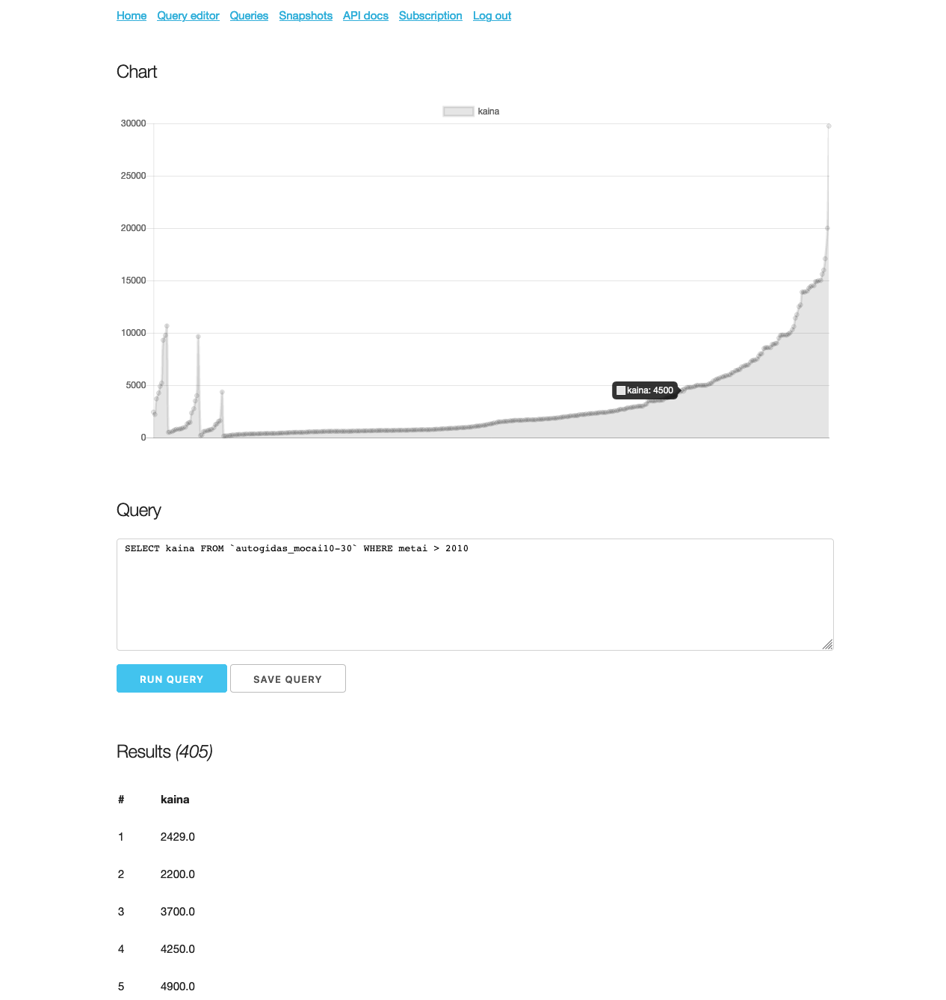

# Scrapethat

Turn any website into SQL database.

I made this one to scratch my own itch.
The use-case was to scrape and parse classified advertisements websites into SQL database to run various queries against the data.

I used it when I was looking for apartment or motorcycle to run analysis of specific year ranges, features, models, and such.
Unfortunately it wasn't as useful as I expected to be.

## Setup

You must have headless chrome and chromedriver setup. Set path to chromedriver in the env variables.

## Workers
This simple setup is not as robust as using supervisord, but it's much simpler:

Run worker as daemon:
`php artisan queue:work &`

Turn off worker (restart does not work, so it just shuts down):
`php artisan queue:restart`

## Writing tests

Using browser kit tests instead of dusk. Tests are faster and as reliable, since we're using almost no JS.

https://github.com/laravel/browser-kit-testing#interacting-with-your-application
